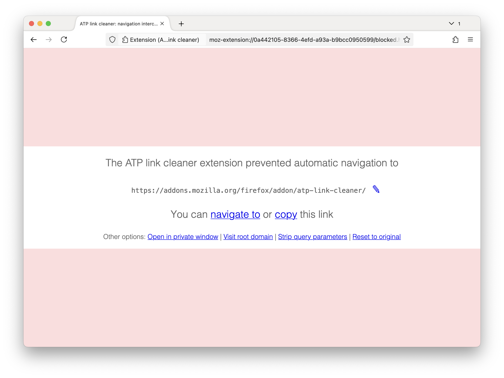

# ATP Link Cleaner

[Office 365 Advanced Threat Protection](https://docs.microsoft.com/en-gb/office365/servicedescriptions/office-365-advanced-threat-protection-service-description) (also known as Microsoft Defender for Office 365) replaces URLs in email messages with an intermediary redirect that makes it much harder to see the original link.

This cross-browser extension filters out that redirect, and replaces it with a simple confirmatory prompt that displays the actual URL that will be visited.

Install via the [Firefox Add-ons store](https://addons.mozilla.org/firefox/addon/atp-link-cleaner/), or as an [unpacked extension](https://developer.chrome.com/docs/extensions/get-started/tutorial/hello-world?hl=en#load-unpacked) for Chrome.

## License
[MIT](https://github.com/simonrob/atp-link-cleaner/blob/master/LICENSE)
